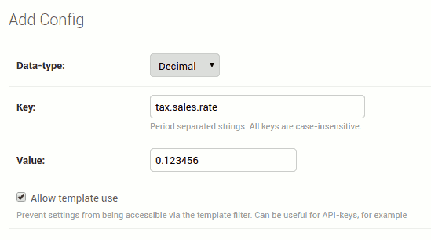

Usage
==============================================

Adding configuration
""""""""""""""""""""

By default this library includes four commonly used data types: strings, booleans, integers and
decimals. You can add custom ones if you feel constrained by these.

Head over to the django admin and add some configuration like so:

..  note::
    Switching the type of data will cause the currently entered value to be coersed into something
    the new type requires, if possible.

Using in templates
""""""""""""""""""

Most of the time you will be using these configured values inside templates like so:

.. code-block:: django

    
    The website admin's email is {{ 'admin.details.email'|get_config }}.

An assignment tag also exists for convenience:

.. code-block:: django

    
    
    The website admin's email is <a href="mailto:{{ email }}">{{ email }}</a>.

If the configuration cannot be found, ``None`` is returned. You have to be careful when falsy values
are possible because the `default` filter will not work in those cases. To produce a default value
for a missing configuration key, use `default_if_none`.

.. code-block:: django

    
    Does the key "foo.bar" exist? {{ 'foo.bar'|get_config|default_if_none:'No' }}.

.. note::
    If the configuration is marked as not available for template use, it will act the same way as
    if it doesn't exist. Data is always available in python code.

Using in python code
""""""""""""""""""""

There's only one straightfoward utility function available, and it can be used like so

.. code-block:: python

    from aboutconfig import get_config

    def my_view(request):
        # some code...
        admin_email = get_config('admin.details.email')
        # some more code...
